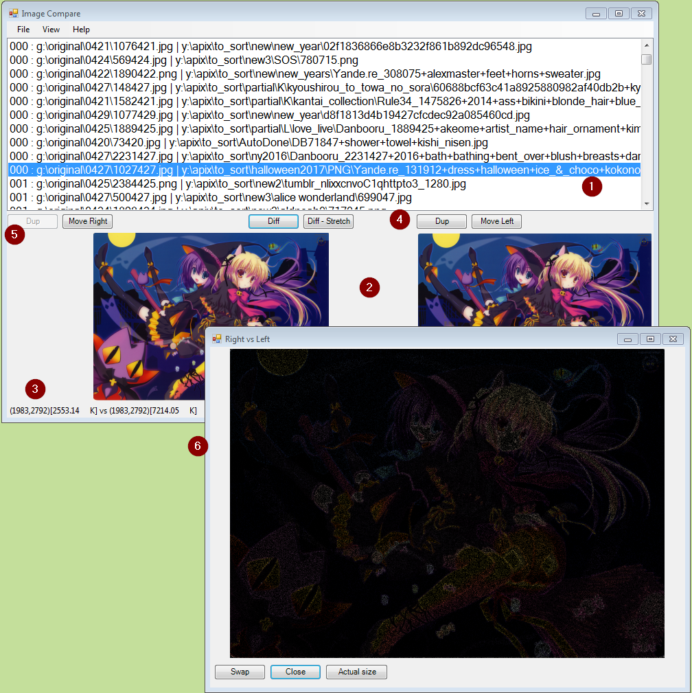

# PHASH
My implementation of "perceptual hash" (phash) for images.

To find duplicate / similar images is a two-phase process.

Phase 1:
Calculate the phash value for all images in a folder and sub-folders. The image paths and phashes are stored in a file.

Phase 2:
Load a file from phase 1 into a viewer. It compares all image phash values and shows a list of image pairs, ordered by phash simularity.
Rows in the list are selected to view the two images side-by-side.

Phase 2a:
More than one phash file from phase 1 may be loaded into the viewer. An example use case is to compare a separate set of recently
downloaded images against an existing set, to find out whether the new images already exist or might be better than the existing.
By using the "Filter same phash" menu, you can focus on matches _between_ the sets, rather than matches _within_ a set.

### Viewer Screen Cap

Two PHash files have been loaded.
1. The list of 'matched' files. The first column shows how 'close' the files match (lower is closer).
2. The currently selected pair of files are show side-by-side, at the same size.
3. The image dimensions and file size of the selected pair of files.
4. You can mark the "right side" file as a duplicate or move it into the left-side folder.
5. You can mark the "left side" file as a duplicate or move it into the right-side folder. In this screen cap, the left 'Dup' 
button has been deliberately disabled (via a menu) as the left side is considered the "master" set.
6. The difference window in action. By clicking the 'Diff' button, the per-pixel differences between the two files is shown.
You can see the difference picture at actual size or fit to window (as shown in the screen cap). If the two images are not
the same size, you can use the 'Diff - Stretch' button to view the differences where the smaller image has been resized to
match the larger.

Not shown: "Filter same phash" option has been used to filter out duplicates within each Phash file.
Not shown: double-clicking on either of the two images in the area marked '2' will invoke the viewing window to show the
actual images, allowing you to examine them "as is" at the same size.

### History
20200201:
Updated the repository with the latest changes.

20160411:
Provide some accumulated changes for the viewer:
1. Context menu on each image, providing access to a rename dialog.
2. Missing images are removed from the list: a) is marked as dup; b) is not found; c) is renamed/moved. Note that removed images are not "remembered" (i.e. the PHASH file is not updated).
3. "Show image" dialog button label actually reflects current view.
4. Diff / Stretch-diff buttons enabled appropriately.
5. Fix a failure to release memory.

20160410:
Added a CRC calculation (based on the image pixels). Allows the viewer program to indicate that a file is an actual duplicate.

20151201:
Upgraded the Phase 1 code/project to use OpenMP for parallelism. Each file will be processed in its own thread.

Timed on my physical machine, processing a directory tree containing 940 images at 196M in size.
Non-OpenMP: 105.66 seconds
    OpenMP:  28.36 seconds
Your mileage may vary, depending on the number of processors you have ...

20151129:
Uploaded the code for the viewer. This version is WinForms/C#. The code has a bit of historic cruft to be removed...

20151128:
Uploaded the code for phase 1. The initial check-in uses CImg to load files; due to various issues it is limited to JPG files only.

Today's update is to replace using CImg to load the files with GDI+. As a result, GIF, PNG, TIFF and BMP files are now supported. Preliminary testing suggests GDI+ is about 25% faster than CImg/libjpeg.

